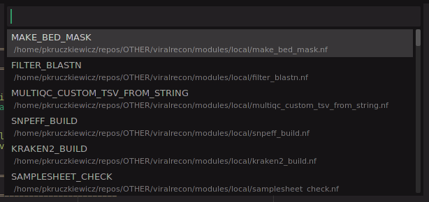
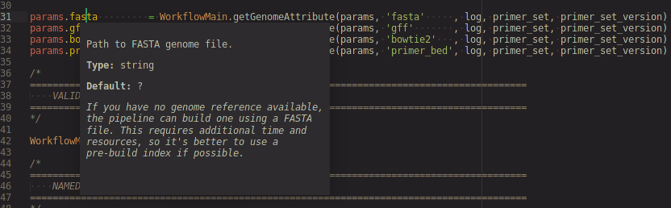
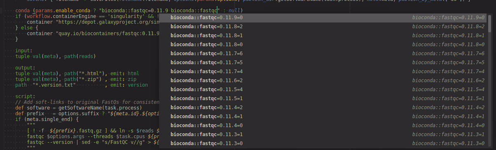
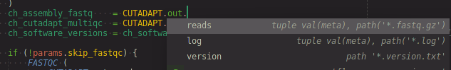
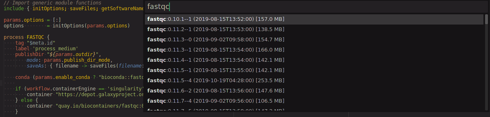
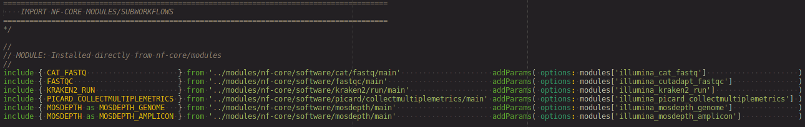
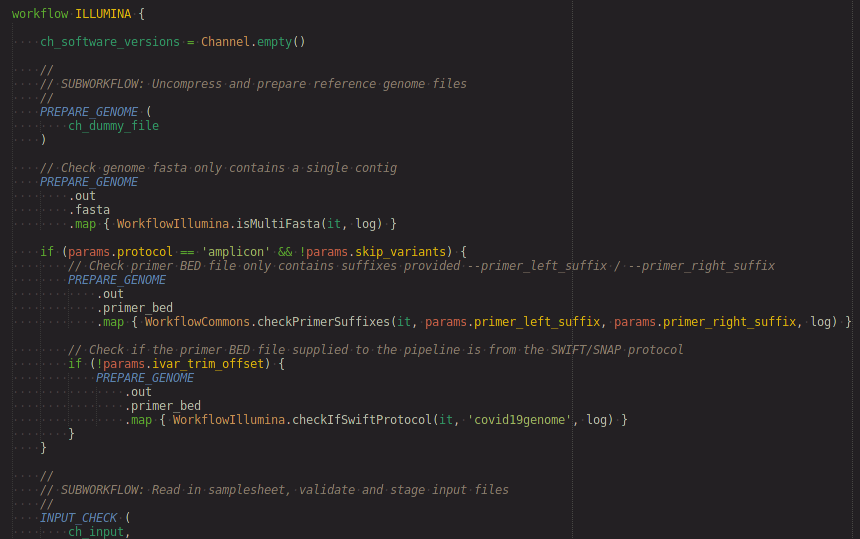
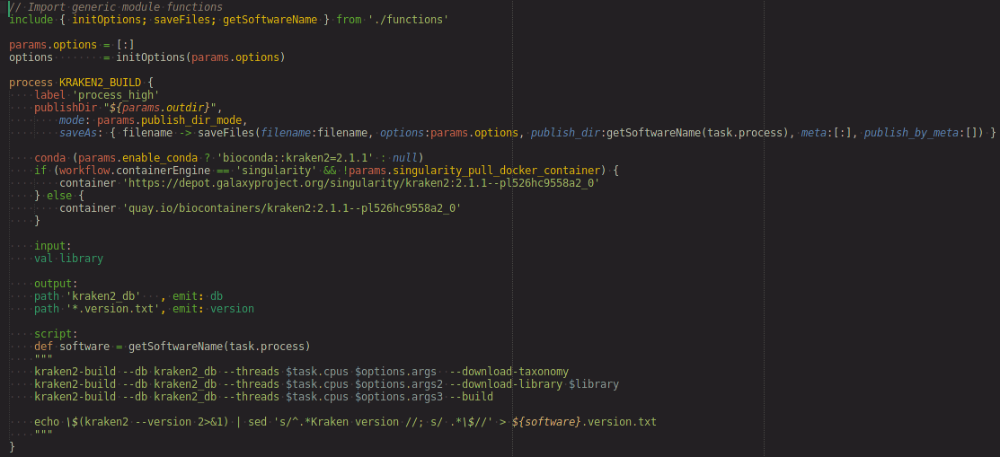
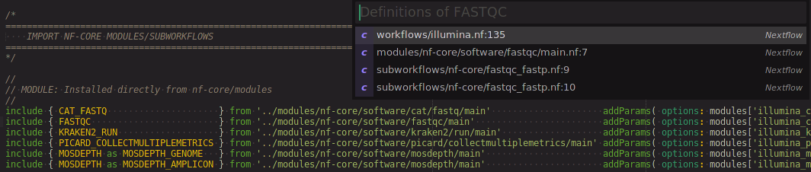

# sublime-nextflow: [Nextflow] workflow completions, commands, syntax highlighting and snippets for [Sublime Text 4]

- **⚠️WARNING⚠️:** Sublime Text 3 is no longer supported by this package as of version 1.0.0. Only Sublime Text 4 is supported since this package requires Python 3.8 and new features in ST4.
- **❗NOTE❗:** Only [DSL-2] Nextflow workflows are supported by this package. 

This package provides [Nextflow] workflow language:

- completions (`params.`, `conda`, `<PROCESS>.out.<emit name>`)
- commands (insert container directive, insert module import statement)
- syntax highlighting
- snippets

Essentially, this package tries to make [Nextflow] workflow development a bit easier especially when trying to develop [nf-core] conventions and best practices for developing [Nextflow] pipelines.

## Nextflow completions and commands

### Process module include command

- `ctrl+l,p` in an `.nf` file where you want to import your process



- select the process you wish to import
- something like the following will be inserted

```nextflow
include { MAKE_BED_MASK } from '../modules/local/make_bed_mask' addParams( options: modules['make_bed_mask'] )
```

The `addParams( options: modules['make_bed_mask'] )` may not be needed and can be removed; it assumes that you have a `conf/modules.config` with a map of your module `args`, `publish_dir`, etc (see [nf-core/modules](https://github.com/nf-core/modules#module-parameters) for more info).

### Workflow `params`

**NOTE:** Completions and info popups for `params` depend on a valid `nextflow_schema.json` in your workflow root directory. Example [`nextflow_schema.json` for nf-core/viralrecon workflow](https://github.com/nf-core/viralrecon/blob/master/nextflow_schema.json).

Navigate cursor to a `params.<variable>` to show a popup with info pulled from the `nextflow_schema.json` for that workflow parameter.




### [Conda] completion

**NOTE:** [Conda] must be installed along with any channels (e.g. [bioconda], [conda-forge]) to get packages information (needs to be able to run `conda search`).

- Open the command palette (`ctrl+shift+p`) and run the `Nextflow: Fetch Conda packages information` command to fetch the latest Conda package info (runs `conda search`; may take a while).
- In your process definition, inside the `conda` directive string press `ctrl+space` to bring up the completion list. *This may have a little delay since the package list may be very large.*

```nextflow
process PANGOLIN {
  conda '<press ctrl+space to bring up completion list>'
}
```



### Process output channel completion

Get process named output (i.e. using the [`emit`](https://www.nextflow.io/docs/latest/dsl2.html#process-named-output) option) completions after typing `<PROCESS_NAME>.out.`.



- completion shows what's on the channel as well!

### Container directive insert command

This command inserts similar code to what you'd find in an [nf-core modules](https://github.com/nf-core/modules) process definition with respect to process `container` directives. The [Biocontainers] information is pulled from the [Singularity][] images [https://depot.galaxyproject.org/singularity/](https://depot.galaxyproject.org/singularity/) and cached as a Python pickle file. [Docker] container image tags point to the [Biocontainers][] [Quay.io page](https://quay.io/organization/biocontainers).

- Open the command palette (`ctrl+shift+p`) and run the `Nextflow: Fetch Biocontainers information` command to fetch the latest [Biocontainers] list fetched from 
- In your process definition, press `ctrl+l,c`, search for the container you're interested in



- Select the program and version you're interested in to output the following:

```nextflow
if (workflow.containerEngine == 'singularity' && !params.singularity_pull_docker_container) {
  container 'https://depot.galaxyproject.org/singularity/fastqc:0.11.9--hdfd78af_1'
} else {
  container 'quay.io/biocontainers/fastqc:0.11.9--hdfd78af_1'
}
```

## Nextflow Syntax Highlighting

Nextflow syntax highlighting extends Sublime Text 4's Groovy syntax with highlighting of: 

- imports (DSL-2 modules)
  
- workflow definitions
  
- process definitions
  
- channel highlighting based on matching `ch_*`
- some invalid syntax checks (into channel in input tag and from channel in output tag)
- highlighting special Nextflow functions and variables (`workflow`, `params`, `task`, etc)

Process syntax highlighting and scoping allows one to easily go to the definition  or usages of a process (`ctrl+shift+g` keyboard shortcut):



## Nextflow Snippets

Type one of the following and press `TAB`:

- `!env`: `#!/usr/bin/env nextflow`
- `proc`: [process](https://www.nextflow.io/docs/latest/process.html) snippet
- `tag`: [tag](https://www.nextflow.io/docs/latest/process.html#tag) process directive snippet
- `pub`: [publishDir](https://www.nextflow.io/docs/latest/process.html#publishdir) process directive snippet
- `illumina`: Illumina paired-end reads file pairs channel
- `cpus`: insert `"${task.cpus}"` into a process script
- `script_path`: specify user script (e.g. Python script) to use from `scripts/` directory in workflow base directory
- `info`: `log.info` snippet 
- `done`: on workflow complete or error message

# Changelog

## 1.0.0 - [2021-06-30]

- Added syntax highlighting for Nextflow DSL-2
- Added completions and commands for workflow `params`, `PROCESS.out.`, conda, container, module include
- Removed some not very useful snippets

## 0.1.0-alpha.1 - [2019-03-27]

- Initial release with Groovy-based syntax highlighting and basic snippets

[DSL-2]: https://www.nextflow.io/docs/latest/dsl2.html
[Nextflow]: https://www.nextflow.io/
[nf-core]: https://nf-co.re/
[Conda]: https://docs.conda.io/en/latest/
[bioconda]: https://bioconda.github.io/
[conda-forge]: https://conda-forge.org/
[Singularity]: https://sylabs.io/guides/3.7/user-guide/quick_start.html
[Docker]: https://www.docker.com/
[Sublime Text 4]: http://www.sublimetext.com/
[Biocontainers]: https://biocontainers.pro/

# License

MIT License

Copyright (c) Peter Kruczkiewicz